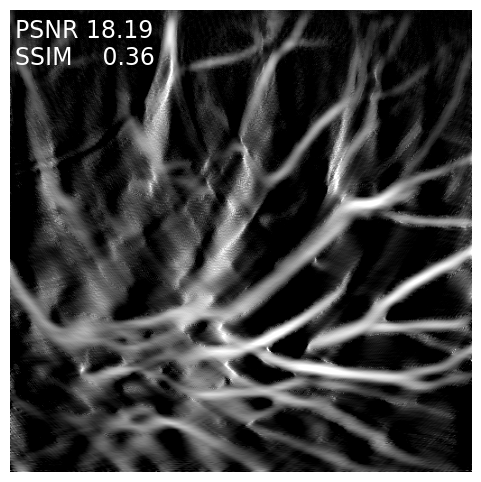
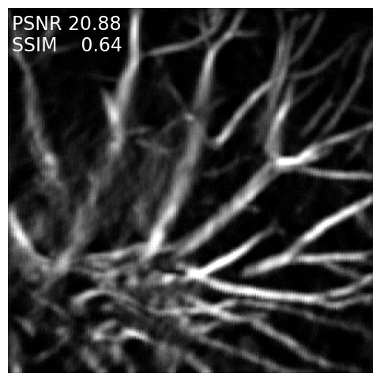
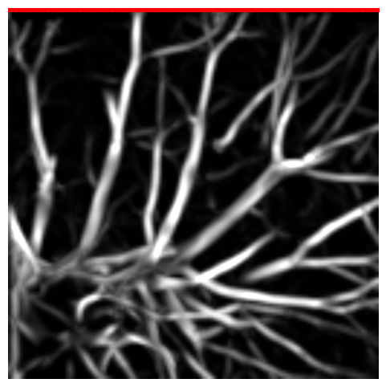

# Summary
Photoacoustic imaging is a medical imaging modality that shows promise as a novel technique for reconstructing high resolution images of clinically relevant structures in subtissue. Clinical applications range from cancerous tumor monitoring to tracking absorption of injected medication in bloodstreams and real-time blood oxygenation measurements. This modality is relatively new thus development of efficient reconstruction algorithms is still an active field. Efficient development of new photoacoustic reconstruction algorithms requires two things. A user-friendly interface for accelerated prototyping and efficient simulations of the underlining physical models. We aim to deliver a package that can satisfy both of these needs. 

<!-- This is the example summary:
The forces on stars, galaxies, and dark matter under external gravitational
fields lead to the dynamical evolution of structures in the universe. The orbits
of these bodies are therefore key to understanding the formation, history, and
future state of galaxies. The field of "galactic dynamics," which aims to model
the gravitating components of galaxies to study their structure and evolution,
is now well-established, commonly taught, and frequently used in astronomy.
Aside from toy problems and demonstrations, the majority of problems require
efficient numerical tools, many of which require the same base code (e.g., for
performing numerical orbit integration).
 -->

# Statement of need
`PhotoAcoustic.jl` is a Julia package that is based on previous software work (JUDI and Devito). 
Devito provides just-in-time compiled C kernels for efficient wave simulations. While JUDI gives access to 
a user-friendly interface to operators that represent the wave simulations. By taking advantage of this previous software and adding photoacoustic domain specific operators and functionality such as ultrasound transducers, `PhotoAcoustic.jl` is the first Julia package to simulate photoacoustic experiments and also solve optimization problems for photoacoustic image reconstruction. 

## Adjoint derivations for optimization
We implement the photoacoustic simulation as the solution to a partial differential equation:

$$\frac{1}{c(x)^2}\frac{\partial^2}{\partial t^2}u(x,t) - \nabla^2 u(x,t) = 0$$

where the photoacoustic source $p_0$ is defined in the initial state of the field:
$$\begin{align}
u(x,0) &= p_0 \\
\dot u(x,0) &= 0.
\end{align}$$

Our main mathematical contribution is the derivation of the adjoint sensitivities of the photoacoustic simulation with respect to both of its inputs: the initial photoacoustic distribution $p_0$ and the speed of sound $c$. As far as we know, this is the first derivation for the 2nd-order wave equation in time. These adjoint sensitivities are motivated by the derivative of a misfit function that is commonly used to reconstruction images based on least squares methods. Calculating these sensitivities entails another adjoint simulation that is implemented in the package with 
efficient computation and user-friendly notation i.e the adjoint of the operator A is simply `A'` or `adjoint(A)`.

## Differentiable programming 
This package has first class differentiability to support developments in scientific machine learning. Previous works such as (cite ADCME.jl) rely on wrapper calls to PyTorch for autodiff. In this package, we manually implement adjoint rules that allows to chain physics derivatives with pure julia differentiation of machine learning models. To illustrate this, we implement the deep image prior by reparameterizing the image of interest as the output of a deep convolutional neural network (Unet) with minimal lines:

    loss, grad = Flux.withgradient(z) do
        norm(A*unet(z)-y)^2
    end

{ width=20% }
{ width=20% }
{ width=20% }

`PhotoAcoustic.jl` enables researchers in inverse problems and in medical fields 
to experiment with new reconstruction algorithms. As a testament to its ease of use, this software was recently used 
in `[@aOrozco:2022]`  to study the uncertainty of photoacoustic reconstruction due to limited-view receiver geometry and the software was also tested in 3D reconstructions `[@bOrozco:2022]`\. There is also ongoing work that will explore techniques for calibration errors and novel uses of the sensitivity with respect to the speed of sound. 
<!-- 
This is the example Statement of need:
`Gala` is an Astropy-affiliated Python package for galactic dynamics. Python
enables wrapping low-level languages (e.g., C) for speed without losing
flexibility or ease-of-use in the user-interface. The API for `Gala` was
designed to provide a class-based and user-friendly interface to fast (C or
Cython-optimized) implementations of common operations such as gravitational
potential and force evaluation, orbit integration, dynamical transformations,
and chaos indicators for nonlinear dynamics. `Gala` also relies heavily on and
interfaces well with the implementations of physical units and astronomical
coordinate systems in the `Astropy` package [@astropy] (`astropy.units` and
`astropy.coordinates`).

`Gala` was designed to be used by both astronomical researchers and by
students in courses on gravitational dynamics or astronomy. It has already been
used in a number of scientific publications [@Pearson:2017] and has also been
used in graduate courses on Galactic dynamics to, e.g., provide interactive
visualizations of textbook material [@Binney:2008]. The combination of speed,
design, and support for Astropy functionality in `Gala` will enable exciting
scientific explorations of forthcoming data releases from the *Gaia* mission
[@gaia] by students and experts alike.

Single dollars ($) are required for inline mathematics e.g. $f(x) = e^{\pi/x}$

Double dollars make self-standing equations:

$$\Theta(x) = \left\{\begin{array}{l}
0\textrm{ if } x < 0\cr
1\textrm{ else}
\end{array}\right.$$

You can also use plain \LaTeX for equations
\begin{equation}\label{eq:fourier}
\hat f(\omega) = \int_{-\infty}^{\infty} f(x) e^{i\omega x} dx
\end{equation}
and refer to \autoref{eq:fourier} from text.

# Citations

Citations to entries in paper.bib should be in
[rMarkdown](http://rmarkdown.rstudio.com/authoring_bibliographies_and_citations.html)
format.

If you want to cite a software repository URL (e.g. something on GitHub without a preferred
citation) then you can do it with the example BibTeX entry below for @fidgit.

For a quick reference, the following citation commands can be used:
- `@author:2001`  ->  "Author et al. (2001)"
- `[@author:2001]` -> "(Author et al., 2001)"
- `[@author1:2001; @author2:2001]` -> "(Author1 et al., 2001; Author2 et al., 2002)"

Figures can be included like this:

and referenced from text using \autoref{fig:example}.

Figure sizes can be customized by adding an optional second parameter:
{ width=20% }
 -->

# Acknowledgements
DO WE NEED TO SAY ML4 seismic here? 

# References

